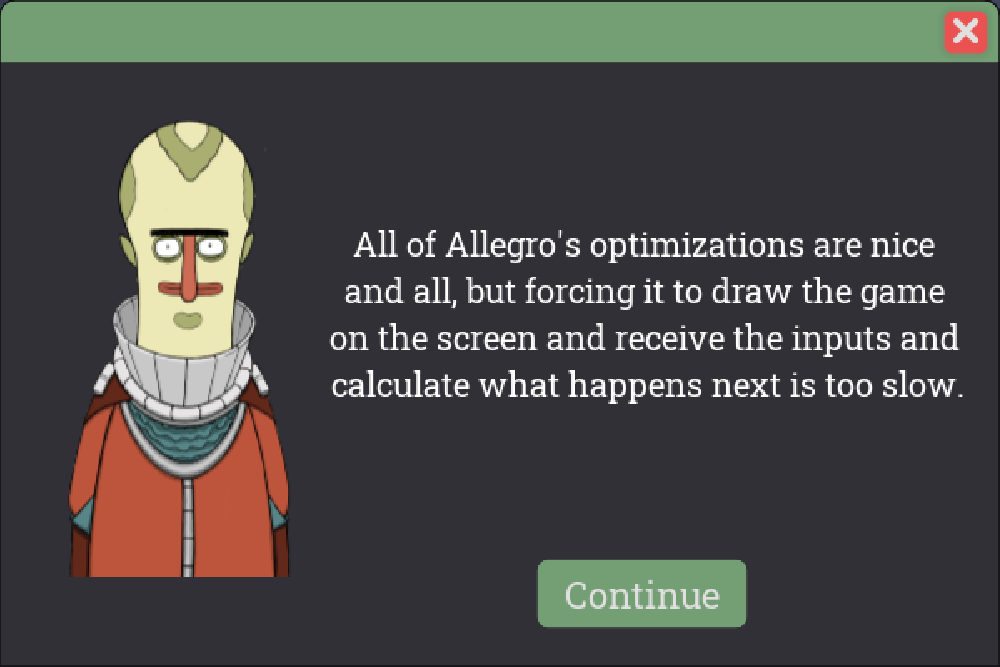
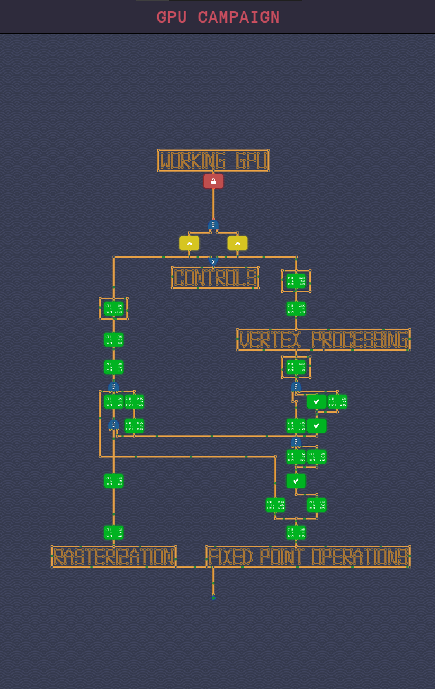
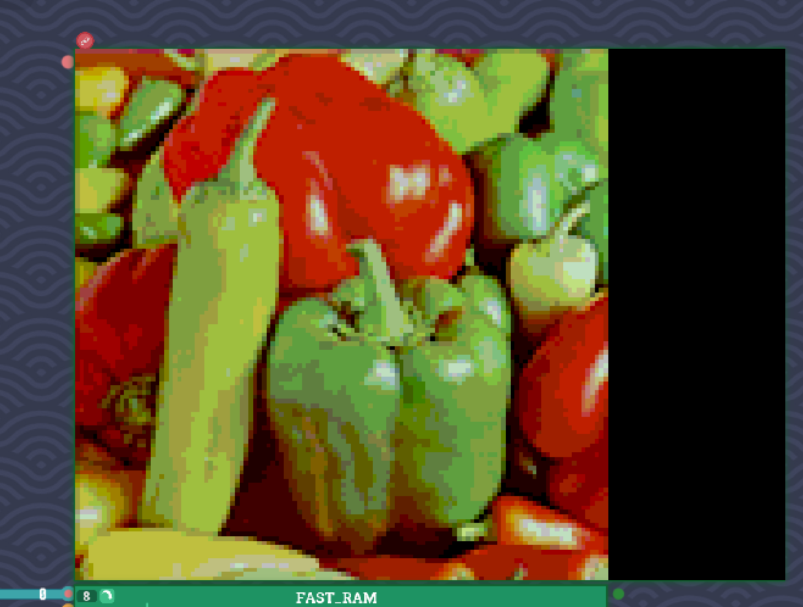

# Hoodoo GPU architecture custom campaign

This is the repository containing levels of the custom campaign for the game [Turing Complete](https://store.steampowered.com/app/1444480/Turing_Complete/).

## Installation Instructions

First of all, you need to download the campaign:
1. Download one of the releases on the right side
2. Unpack the contents (You should get a bunch of folders starting with `gpu_`)
3. Move the folders into the level directory in your Turing Complete game files
4. Start the game

Then you have three ways to play the campaign:
1. In the main menu, press `Q` and in the console type `load gpu_campaign`, and press `Enter`.
That will load the campaign screen.
Unfortunately with this approach you have to load the campaign screen again after completing each level.

2. Using `dev_mode` you can add the `gpu_campaign` level to the main campaign screen.
That makes it much easier to open the campaign each time you complete a level.

3. Using `dev_mode` you can add all the levels of the campaign to the main campaign screen.
This approach is the most work, but after completing a level you are moved back directly to the campaign.

## Features

- Introduction to signed fixed-point numbers
- Explaining the basics of rasterization, including color interpolation and barycentric coordinates
- Build a GPU capable of rendering 3D models

## Preview

## Roadmap

* To finish V1:
    * Setting up the MVP matrix and projecting vertices
    * Decoding five simple commands (draw, get_status, change_ram_offset, change_triangle_count, change_mvp)
    * Getting the rasterizer and vertex transformer together into `Hoodoo V1`
* For V2:
    * Half-pixel correction
    * Alpha composition
    * Backface culling
    * Hardware dithering
    * Double buffering
    * Z-buffer
    * More rasterizers in parallel
    * Fully programmable pipeline

## Contributing

If you want to contribute to the campaign, feel free to report bugs, make feature requests and send PRs!

**Enjoy!**